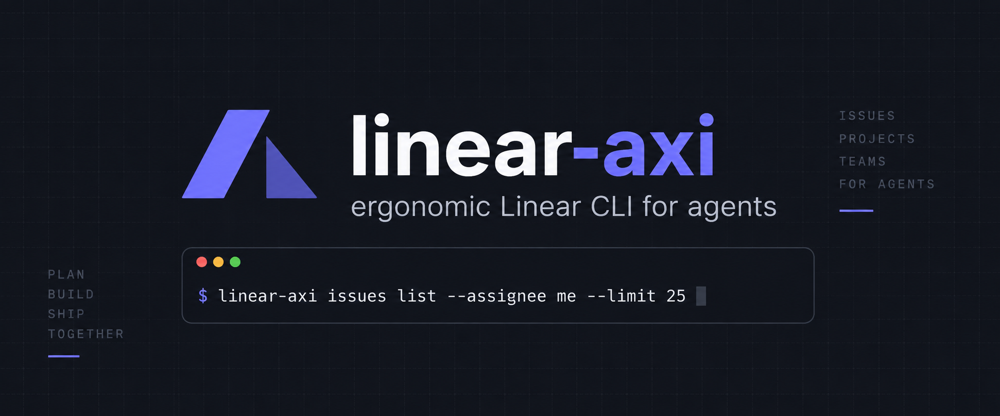

<h1 align="center">linear-axi</h1>

`linear-axi` is an [Agent eXperience Interface (AXI)](https://github.com/kunchenguid/axi) that lets AI agents work with Linear. It exposes Linear MCP operations through compact, structured commands designed for token efficiency, predictable errors, and useful next steps.

## Install

linear-axi requires Node.js 24 or newer. Install it globally with npm:

```sh
npm install -g @nikolauska/linear-axi
linear-axi --help
```

## Install the agent skill

Install the marketplace plugin for your agent:

```text
# Claude Code
/plugin marketplace add nikolauska/linear-axi
/plugin install linear-axi@linear-axi

# Codex
codex plugin marketplace add nikolauska/linear-axi
codex plugin add linear-axi@linear-axi

# GitHub Copilot CLI
copilot plugin marketplace add nikolauska/linear-axi
copilot plugin install linear-axi@linear-axi
```

Alternatively, install the portable Agent Skill with the [Skills CLI](https://github.com/vercel-labs/skills):

```sh
npx skills add nikolauska/linear-axi -g
```

These options install the agent instructions. The `linear-axi` command must still be installed separately.

Read [how linear-axi works](docs/domain/how-linear-axi-works.md) for the product workflow and [CONTRIBUTING.md](CONTRIBUTING.md) to work on the project. For agent usage, see the [linear-axi skill](skills/linear-axi/SKILL.md).
